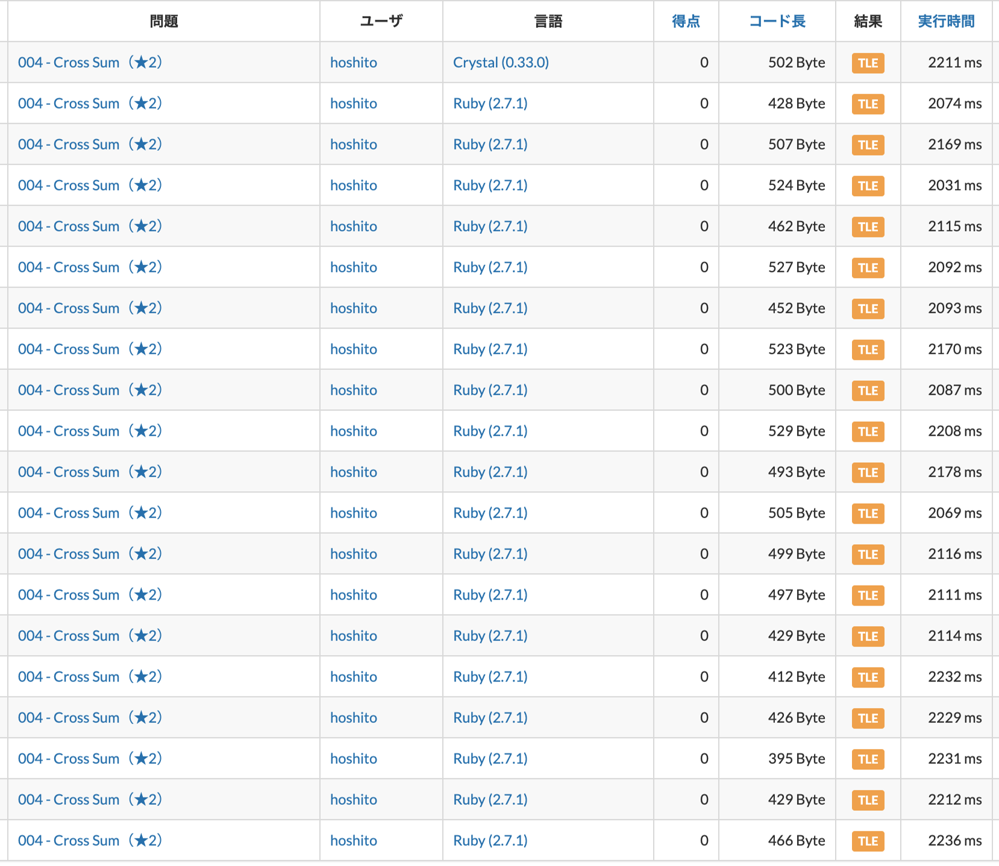

# AtCoderで学ぶRubyの高速化

## 問題

[004 - Cross Sum（★2）](https://atcoder.jp/contests/typical90/tasks/typical90_d)

## 普通に解いてみる

### 骨組みを作る

#### 入力の受け取り方

```ruby
# 入力の受け取り
h,w = gets.chomp.split(" ").map(&:to_i)
matrix = h.times.map{gets.chomp.split.map(&:to_i)}
```

#### 出力の宣言

```ruby
# 二重配列の宣言
ans = Array.new(h).map{Array.new(w, 0)}

# -------------
# なんらかの計算
# -------------

# ansの出力
ans.each do |row|
  puts row.join(" ")
end
```

#### matrixに対するループ

```ruby
# matrixに対するループ
0.upto(h-1) do |hi|
  0.upto(w-1) do |wi|
    # -------------
    # なんらかの計算
    # -------------
  end
end
```

#### 骨組み

上を組み合わせるとこうなる

```ruby
# 入力の受け取り
h,w = gets.chomp.split(" ").map(&:to_i)
matrix = h.times.map{gets.chomp.split.map(&:to_i)}

# 二重配列の宣言
ans = Array.new(h).map{Array.new(w, 0)}

# matrixに対するループ
0.upto(h-1) do |hi|
  0.upto(w-1) do |wi|
    # -------------
    # なんらかの計算
    # -------------
  end
end

# ansの出力
ans.each do |row|
  puts row.join(" ")
end
```


### 問題文の通りに書く

なんらかの計算のところを埋めていきたい

```ruby
# matrixに対するループ
0.upto(h-1) do |hi|
  0.upto(w-1) do |wi|
    # -------------
    # なんらかの計算
    # -------------
    # ans[hi][wi] = ???
  end
end
```

> マス (i, j) と同じ行または同じ列にあるマス（自分自身を含む）に書かれている整数をすべて合計した値

```ruby
sum_h = (0..h-1).map {|hi2| matrix[hi2][wi] }.sum
sum_w = (0..w-1).map {|wi2| matrix[hi][wi2] }.sum
ans[hi][wi] = sum_h + sum_w - matrix[hi][wi]
```

#### 回答1

```ruby
# 入力の受け取り
h,w = gets.chomp.split(" ").map(&:to_i)
matrix = h.times.map{gets.chomp.split.map(&:to_i)}

# 二重配列の宣言
ans = Array.new(h).map{Array.new(w, 0)}

# matrixに対するループ
0.upto(h-1) do |hi|
  0.upto(w-1) do |wi|
    # -------------
    # なんらかの計算
    # -------------
    sum_h = (0..h-1).map {|hi2| matrix[hi2][wi] }.sum
    sum_w = (0..w-1).map {|wi2| matrix[hi][wi2] }.sum
    ans[hi][wi] = sum_h + sum_w - matrix[hi][wi]
  end
end

# ansの出力
ans.each do |row|
  puts row.join(" ")
end
```

ロジックはあっているが遅い。(200, 200)のサイズの問題で1242ms秒。実際の問題は(2000, 2000)のサイズなので単純に計算すると100倍はかかってしまう。

原因は計算量。3重ループが回っているので O(N^3) のオーダー。

## AtCoder慣れた人の回答

3重ループの解消に挑む。

`sum_h`と`sum_w`は使い回すことができる。例えば`ans[0][0]`を求めるときと`ans[0][1]`を求めるときは`sum_h`は同じ計算をしていることになるので。

### 回答

実際に私が初見で書いたコード。

```ruby
h,w = gets.chomp.split(" ").map(&:to_i)
matrix = h.times.map{gets.chomp.split.map(&:to_i)}

sum_h = Array.new(h, 0)
sum_w = Array.new(w, 0)
0.upto(h-1) do |hi|
  0.upto(w-1) do |wi|
    sum_h[hi] += matrix[hi][wi]
    sum_w[wi] += matrix[hi][wi]
  end
end

0.upto(h-1) do |hi|
  ans = []
  0.upto(w-1) do |wi|
    ans << sum_h[hi] + sum_w[wi] - matrix[hi][wi]
  end
  puts ans.join(" ")
end
```

二重ループになったがこれでも遅い。(2000, 2000)のサイズで2237ms。実行制限時間が2000msなのでちょっと遅い。

コンパイル言語だと上のロジックで十分高速。数百ms, C++で最適化すると100ms切る。

死屍累々…。



## 高速化のテクニック

いまから紹介するテクニックをひとつでも欠かすとTLEになってしまう。

### 標準入力の受け取り

- `map(&:to_i)` ではなくブロックを渡す方が速い
- 配列の作成は`Array.new`の方が速い

#### NG

```ruby
h,w = gets.chomp.split(" ").map(&:to_i)
matrix = h.times.map{gets.chomp.split.map(&:to_i)}
```

#### OK

```ruby
h,w = gets.split.map{ |e| e.to_i }
matrix = Array.new(h){ gets.split.map{ |e| e.to_i } }
```

※ `chomp`はあってもなくてもOK

### ループの回し方

- `times`や`upto`より`while`の方が速い

#### NG

```ruby
sum_h = Array.new(h, 0)
sum_w = Array.new(w, 0)
0.upto(h-1) do |hi|
  0.upto(w-1) do |wi|
    sum_h[hi] += matrix[hi][wi]
    sum_w[wi] += matrix[hi][wi]
  end
end
```

#### OK

```ruby
sum_h = Array.new(h, 0)
sum_w = Array.new(w, 0)
hi = 0
while hi < h do
  wi = 0
  while wi < w do
    sum_h[hi] += matrix[hi][wi]
    sum_w[wi] += matrix[hi][wi]
    wi += 1
  end
  hi += 1
end
```

### 文字列の結合

- 文字列は `<<` で結合する方が速い

#### NG

```ruby
0.upto(h-1) do |hi|
  ans = []
  0.upto(w-1) do |wi|
    ans << sum_h[hi] + sum_w[wi] - matrix[hi][wi]
  end
  puts ans.join(" ")
end
```

#### OK

```ruby
SPACE = " "
hi = 0
while hi < h do
  ans = ""
  wi = 0
  while wi < w do
    ans << (sum_h[hi] + sum_w[wi] - matrix[hi][wi]).to_s
    ans << SPACE
    wi += 1
  end
  hi += 1
  puts ans
end
```

### 回答

```ruby
h,w = gets.split.map{ |e| e.to_i }
# NG: h.times.map{gets.chomp.split.map(&:to_i)}
# NG: Array.new(h){ gets.split.map(&:to_i) }
matrix = Array.new(h){ gets.split.map{ |e| e.to_i } }

sum_h = Array.new(h, 0)
sum_w = Array.new(w, 0)
# NG: `h.times do |hi|`, `0.upto(h-1) do |hi|`
hi = 0
while hi < h do
  wi = 0
  while wi < w do
    sum_h[hi] += matrix[hi][wi]
    sum_w[wi] += matrix[hi][wi]
    wi += 1
  end
  hi += 1
end

SPACE = " "
hi = 0
while hi < h do
  # NG: ans = [] して最後にans.join(" ")
  ans = ""
  wi = 0
  while wi < w do
    # NG: ans += 
    ans << (sum_h[hi] + sum_w[wi] - matrix[hi][wi]).to_s
    # NG: ans << ''
    ans << SPACE
    wi += 1
  end
  hi += 1
  # ans << "\n" してまとめてputsしてもOK
  puts ans
end
```

これが1971ms

## 類似問題

- [https://atcoder.jp/contests/abc129/tasks/abc129_d](https://atcoder.jp/contests/abc129/tasks/abc129_d)
- [https://atcoder.jp/contests/abc189/tasks/abc189_c](https://atcoder.jp/contests/abc189/tasks/abc189_c)

## 高速化について参考ブログ

- [https://zenn.dev/universato/articles/20201210-z-ruby#discuss](https://zenn.dev/universato/articles/20201210-z-ruby#discuss)
- [https://github.com/universato/ac-library-rb](https://github.com/universato/ac-library-rb)

## Crystal

実際に私が初見で書いたコード。

```rb
h,w = gets.chomp.split(" ").map(&:to_i)
matrix = h.times.map{gets.chomp.split.map(&:to_i)}

sum_h = Array.new(h, 0)
sum_w = Array.new(w, 0)
0.upto(h-1) do |hi|
  0.upto(w-1) do |wi|
    sum_h[hi] += matrix[hi][wi]
    sum_w[wi] += matrix[hi][wi]
  end
end

0.upto(h-1) do |hi|
  ans = []
  0.upto(w-1) do |wi|
    ans << sum_h[hi] + sum_w[wi] - matrix[hi][wi]
  end
  puts ans.join(" ")
end
```

これ2237ms

謎のコード。

```ruby
h,w = read_line.split.map{ |e| e.to_i }
matrix = Array.new(h){ read_line.split.map{ |e| e.to_i } }

sum_h = Array.new(h, 0)
sum_w = Array.new(w, 0)
hi = 0
0.upto(h-1) do |hi|
  0.upto(w-1) do |wi|
    sum_h[hi] += matrix[hi][wi]
    sum_w[wi] += matrix[hi][wi]
  end
end

0.upto(h-1) do |hi|
  ans = [] of Int32
  0.upto(w-1) do |wi|
    ans << sum_h[hi] + sum_w[wi] - matrix[hi][wi]
  end
  puts ans.join(" ")
end
```

これ500ms

???

### Crystalとは

[Crystal (プログラミング言語)](https://ja.wikipedia.org/wiki/Crystal_(%E3%83%97%E3%83%AD%E3%82%B0%E3%83%A9%E3%83%9F%E3%83%B3%E3%82%B0%E8%A8%80%E8%AA%9E))

>Crystal (クリスタル) は、オブジェクト指向の汎用プログラミング言語である。静的型付けのコンパイラ言語であり、Rubyの影響を受けた構文となっている[6]。型推論によって変数や仮引数の型の宣言を省略することができる[6]。Crystalの開発は活発に行われており、Apache License 2.0の下でフリーかつオープンソースのソフトウェアとして配布されている[5]。

[https://crystal-lang.org](https://crystal-lang.org)
