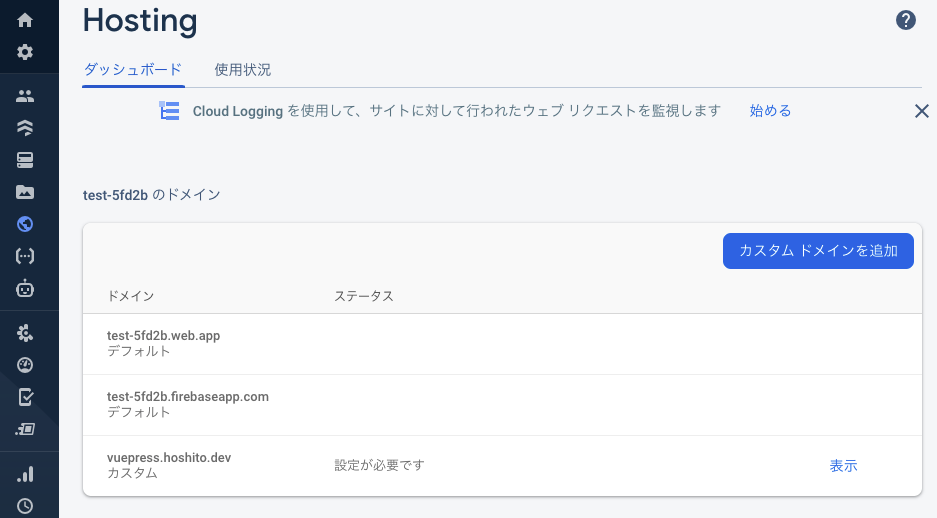

# Firebaseにデプロイ

## VuePressのビルド

```
$ cd docs
$ yarn build
```

## デプロイ

あらかじめ画面でfirebaseのプロジェクトを作っておくこと

```
$ firebase login
  - 500エラーが出るなら firebase login --no-localhost で試す
  - 500エラーが出るならコンソールに出てくるURLを直接ブラウザに貼ってアクセス
  - 500エラーが出るなら何度かリロードしてみる

$ firebase init
  - Hostingを選択
  - Use an existing projectを選択
    - firebaseで作ったプロジェクトを指定
  - docs/src/.vuepress/distを指定
  - 以降は全部NO

$ firebase deploy
```

## カスタムドメインの追加 (Optional)



今回はGoogle Domainsで取得したドメインを割り当てている。Firebaseで設定した後、Google Domainsのページにて DNS > カスタムリソースレコード で名前を「vuepress」, タイプを「A」, データを(Firebaseで指定されたIPアドレス)に設定する。

## Netlifyと比べて

Netlifyでも同様なことはできるがページの読み込み速度という観点からおすすめしない。

[Netlifyが日本からだと遅い](https://blog.anatoo.jp/2020-08-03)

CDNが日本国内に無いので特に画像の読み込み速度がとても遅い。
