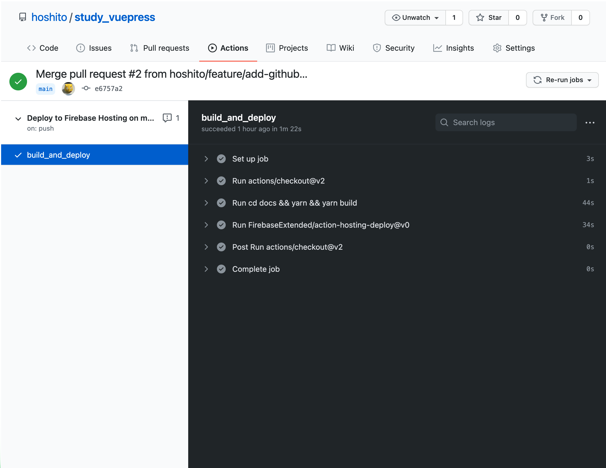
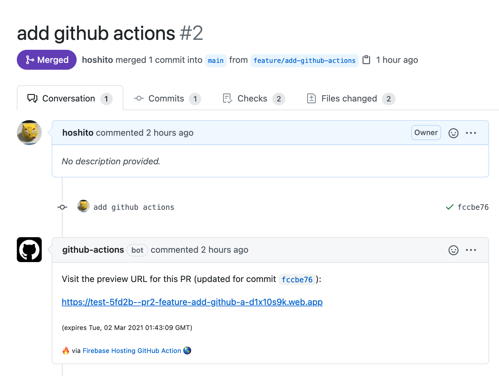
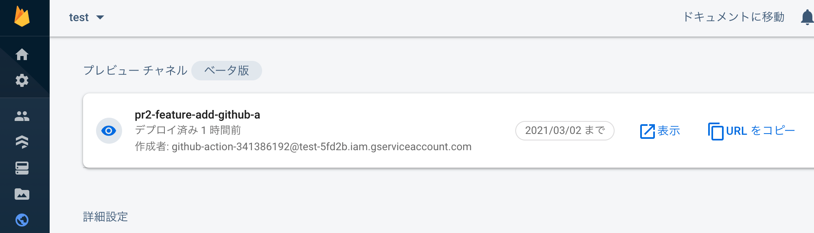

# GitHub Actionsとの連携

mainブランチが更新された際に自動的にFirebaseにデプロイするよう設定する。

ついでにプルリクエスト作成時にレビュー用のデプロイが走る（後述）ように設定する。

## 自動デプロイ設定

```
$ firebase init hosting:github

     ######## #### ########  ######## ########     ###     ######  ########
     ##        ##  ##     ## ##       ##     ##  ##   ##  ##       ##
     ######    ##  ########  ######   ########  #########  ######  ######
     ##        ##  ##    ##  ##       ##     ## ##     ##       ## ##
     ##       #### ##     ## ######## ########  ##     ##  ######  ########

...

=== Project Setup

First, let's associate this project directory with a Firebase project.
You can create multiple project aliases by running firebase use --add, 
but for now we'll just set up a default project.

# 自動的にリンクが開いてGitHubに認証をかけにいく
i  .firebaserc already has a default project, using test-5fd2b.

=== Hosting:github Setup

Visit this URL on this device to log in:
https://github.com/login/oauth/authorize?client_id=xxx

Waiting for authentication...

✔  Success! Logged into GitHub as hoshito

# リポジトリ名を入れる
? For which GitHub repository would you like to set up a GitHub workflow? (format: user/repository) hoshito/study_vuepress

✔  Created service account github-action-341386192 with Firebase Hosting admin permissions.
✔  Uploaded service account JSON to GitHub as secret FIREBASE_SERVICE_ACCOUNT_TEST_5FD2B.
i  You can manage your secrets at https://github.com/hoshito/study_vuepress/settings/secrets.

# ビルドするかどうか
? Set up the workflow to run a build script before every deploy? Yes
# ビルドする際のコマンド
? What script should be run before every deploy? cd docs && yarn && yarn build

✔  Created workflow file /Users/hoshito/work/study/study_vuepress/.github/workflows/firebase-hosting-pull-request.yml
? Set up automatic deployment to your site's live channel when a PR is merged? Yes
? What is the name of the GitHub branch associated with your site's live channel? main

✔  Created workflow file /Users/hoshito/work/study/study_vuepress/.github/workflows/firebase-hosting-merge.yml

i  Action required: Visit this URL to revoke authorization for the Firebase CLI GitHub OAuth App:
https://github.com/settings/connections/applications/89cf50f02ac6aaed3484
i  Action required: Push any new workflow file(s) to your repo

i  Writing configuration info to firebase.json...
i  Writing project information to .firebaserc...

✔  Firebase initialization complete!
```

設定した後 `$ git push origin master` にてmasterにマージすると自動的にビルド&デプロイが実行される。



手動でビルド&デプロイをする際は `$ yarn build` `$ firebase deploy` の2コマンド。これを打つ代わりにgitのadd, commit, pushを打つようになるので、実行するコマンド数が減るわけではない。

`$ yarn build` と `$ firebase deploy` は実行時間が少しかかるので待つ必要が無くなるというメリットと、gitのバージョン管理の癖がつくのがメリット。JavaScriptに手を加えたりするのでgitのバージョン管理の方は意外とメリットとなり得る。

## レビュー用デプロイ

プルリクエストを作成すると自動的にビルド&デプロイが走る。



デプロイ先は本番と異なるところ。Firebaseで「プレビューチャネル」というプレビュー用のデプロイ先が用意されている。


