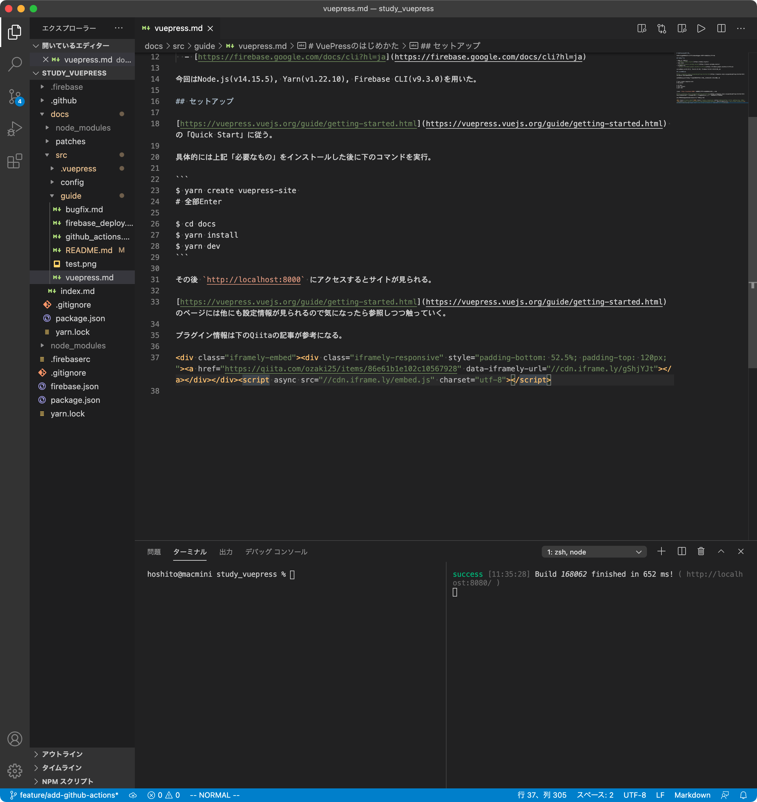
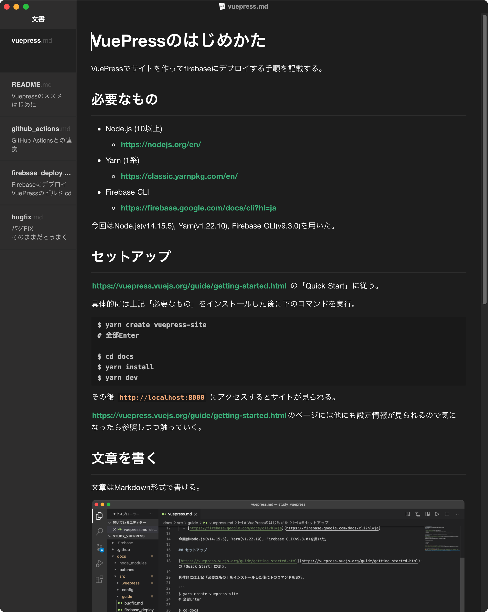

# VuePressのはじめかた

VuePressでサイトを作ってfirebaseにデプロイする手順を記載する。

## 必要なもの

- Node.js (10以上)
  - [https://nodejs.org/en/](https://nodejs.org/en/)
- Yarn (1系)
  - [https://classic.yarnpkg.com/en/](https://classic.yarnpkg.com/en/)
- Firebase CLI
  - [https://firebase.google.com/docs/cli?hl=ja](https://firebase.google.com/docs/cli?hl=ja)

今回はNode.js(v14.15.5), Yarn(v1.22.10), Firebase CLI(v9.3.0)を用いた。

## セットアップ

[https://vuepress.vuejs.org/guide/getting-started.html](https://vuepress.vuejs.org/guide/getting-started.html) の「Quick Start」に従う。

具体的には上記「必要なもの」をインストールした後に下のコマンドを実行。

```
$ yarn create vuepress-site 
# 全部Enter

$ cd docs
$ yarn install
$ yarn dev
```

その後 `http://localhost:8000` にアクセスするとサイトが見られる。

[https://vuepress.vuejs.org/guide/getting-started.html](https://vuepress.vuejs.org/guide/getting-started.html)のページには他にも設定情報が見られるので気になったら参照しつつ触っていく。

## 文章を書く

文章はMarkdown形式で書ける。お好みのエディタで書くと良い。

保存するたびに `http://localhost:8000` に更新がかかるので、ブラウザ上の見た目はこちらでチェック。

#### VSCode


#### Typora
[https://typora.io](https://typora.io)

このエディタはConfluenceのように書くスペースとプレビューが同じで読みやすい。



## プラグイン

下のQiitaの記事が参考になる。

<div class="iframely-embed"><div class="iframely-responsive" style="padding-bottom: 52.5%; padding-top: 120px;"><a href="https://qiita.com/ozaki25/items/86e61b1e102c10567928" data-iframely-url="//cdn.iframe.ly/gShjYJt"></a></div></div><script async src="//cdn.iframe.ly/embed.js" charset="utf-8"></script>
